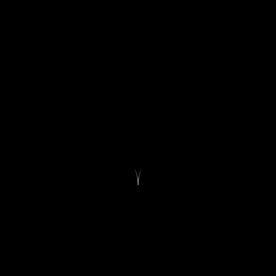

# Growthx Assignment — README

> A friendly guide to run, explore and learn from the `growthx-assignment` project.

---

## 📌 Project snapshot

This repository is a small React + Vite project that demonstrates a one-time CSS animation with a **"Replay Animation"** button that appears **only after** the animation finishes. When the user clicks the replay button, the same animation runs again — but the button is hidden while the animation runs.

> This README helps you install, run, and understand how the animation + replay behavior is implemented. It also includes copy-to-clipboard helpers for code snippets (works on hosted docs that allow inline JS). 🧩

---

## 📋 Table of Contents

1. [Prerequisites](#-prerequisites)
2. [Install & Run](#-install--run)
3. [Available Scripts](#-available-scripts)
4. [How the animation & replay works (concept)](#-how-the-animation--replay-works-concept)
5. [Screenshots & assets](#-screenshots--assets)

---

## 🛠️ Prerequisites

Make sure you have the following installed on your machine:

* **Node.js** — recommended `>= 18` (or at least Node 16+). Check with:

```bash
node -v
```

* **npm** (comes with Node) or **pnpm** / **yarn** (optional if you prefer).
* **Git** (optional, for cloning/publishing).

> If you need help installing Node.js: [https://nodejs.org/](https://nodejs.org/) (choose LTS). ✅

---

## ⚡ Install & Run

Open a terminal at the project root and run:

```bash
# install dependencies
npm install

# start dev server
npm run dev
```

You should see Vite's dev server URL (usually `http://localhost:5173`) — open that in your browser.

### Build for production

```bash
npm run build
```

### Preview the production build locally

```bash
npm run preview
```

### Linting

```bash
npm run lint
```

---

## 🧾 Available scripts (from `package.json`)

* `dev` — runs `vite` in dev mode.
* `build` — runs `vite build` to produce optimized output.
* `preview` — serves the production build locally.
* `lint` — runs `eslint .` to lint project files.

You can copy these commands easily using the copy buttons below (if your markdown renderer supports them). 🧰

---

## ✨ How the animation & replay works (concept)


* Animation runs *once* automatically when the component mounts / page loads.
* When the animation finishes, a **"Replay Animation"** button appears.
* Clicking the button runs the exact animation again. While the animation is running, the button should be hidden so users must wait until the animation ends before triggering it again.

---

## 🖼️ Animation



---